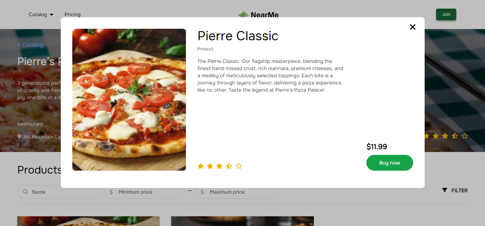

# NearMe

NearMe is our 2023 Congressional App Challenge submission. It was developed by [@theron-wang](https://github.com/theron-wang), [@aumshah](https://github.com/aumshah), [@tatvakabat](https://github.com/tatvakabat), and [@TheCoder215](https://github.com/TheCoder215).

## Features

Homepage of NearMe

Catalog showing local businesses, auto-sorted based on client user distance

Users can order and rate products and services offered by each business on their page. These orders, as well as their status, can also
be updated on the user's end of things as well.

## Running the App

1. Create a folder called `images` in `src\LocalBusinessDirectory`
2. Set up a local SQL Server 2022 instance and publish the database to it
3. Add the connection string to `secrets.json`
4. Run the app using `dotnet run`

